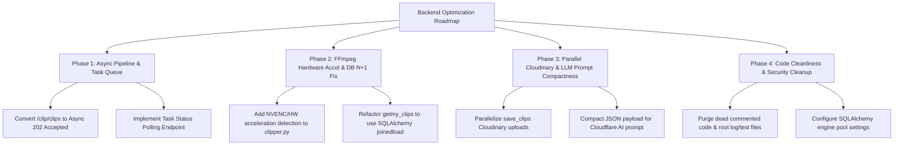

# ClipGen Backend Codebase Optimization Report

This document provides a thorough analysis of the **ClipGen Backend** codebase, identifying key performance bottlenecks, architectural inefficiencies, resource consumption issues, and code smells, along with actionable, step-by-step recommendations for optimization.

---

## Executive Summary of Findings

| Priority | Category | Key Issue | Impact / Bottleneck | Recommended Fix |
| :--- | :--- | :--- | :--- | :--- |
| 🔴 **Critical** | **Architecture & Async** | Long video pipeline runs synchronously inside HTTP endpoints (`POST /clip/clips`, `POST /clip/yt_clipgen`) | Blocks HTTP worker threads for 1–5+ mins; causes 504 Gateway Timeouts; prevents concurrent request handling | Move pipeline execution to background workers (FastAPI `BackgroundTasks`, Celery, or Redis Queue) with asynchronous task status polling |
| 🔴 **Critical** | **Video Rendering & FFmpeg** | FFmpeg runs purely on CPU H.264 without hardware acceleration; clips rendered sequentially | Slow clip generation (100% CPU lock during encoding); linear increase in response time per clip | Enable GPU hardware acceleration (`h264_nvenc`, `h264_qsv`, or `h264_videotoolbox`) and optimize FFmpeg preset/concurrency |
| 🟠 **High** | **Cloud CDN Uploads** | Sequential Cloudinary uploads for each generated clip and raw video uploaded before processing | Unnecessary upload bandwidth overhead; multiplied post-processing network latency | Parallelize clip uploads using `asyncio.gather` / `ThreadPoolExecutor`; defer full source video upload |
| 🟠 **High** | **Database Queries** | N+1 queries in `GET /clip/getmy_clips` endpoint | Executes 1 + N SQL queries for fetching user videos and their clips | Use SQLAlchemy `joinedload` option (`db.query(Video).options(joinedload(Video.clips))`) |
| 🟡 **Medium** | **AI/ML Model Efficiency** | Redundant `ffprobe` calls; Whisper hardcoded to CPU `tiny`; prompt payload whitespace overhead | Extra subprocess execution per clip; unutilized GPU for transcription; wasted LLM input tokens | Cache video metadata; auto-detect CUDA for Whisper; serialize compact JSON for LLM prompts |
| 🟡 **Medium** | **Database Connection** | Missing explicit SQLAlchemy engine pool limits | Risk of connection exhaustion under concurrent load | Configure `pool_size`, `max_overflow`, and `pool_recycle` on SQLAlchemy engine |
| 🔵 **Low** | **Code Hygiene** | Commented-out routers, dead code blocks, root directory clutter (`test.mp4`, `multiface_debug.log`) | Technical debt, confusion, potential credential exposure | Clean up dead code, consolidate `clipping.py` & `clipping_advanced.py`, enforce strict `.gitignore` |

---

## 1. Architectural & Async Execution Optimizations

### 1.1 Synchronous HTTP Endpoint Blocking
* **File Location**: [`handlers/clipping.py`](file:///d:/WestackAI/clipgen/backend/handlers/clipping.py#L32-L160)
* **Problem**: Endpoints `create_clips_advanced_upload` and `create_clips_advanced_youtube` execute the complete video pipeline synchronously:
  1. File download / save to disk
  2. Audio extraction & Whisper transcription
  3. LLM analysis call (120s HTTP timeout)
  4. MediaPipe multi-face tracking (processing thousands of frames)
  5. Speaker detection & lip-movement MAR analysis
  6. Multi-pass FFmpeg rendering for up to 5 clips
  7. Cloudinary CDN uploads
* **Impact**:
  - A 5-minute video takes 1 to 3 minutes to process.
  - HTTP requests stay open, causing **504 Gateway Timeouts** on Cloudflare, Nginx, or frontend fetch clients (default 60s timeout).
  - FastAPI thread pool workers are held hostage, preventing other users from querying lightweight APIs like `/auth/login` or `/user/me`.

#### Recommended Solution: Asynchronous Task Processing Pattern
Convert long-running processing to an asynchronous job status model:
```python
# Updated API Pattern:
# 1. POST /clip/v2/clips -> Creates job in DB, enqueues task, returns 202 Accepted { "job_id": "..." }
# 2. GET /clip/v2/status/{job_id} -> Polls status: "queued" | "transcribing" | "analyzing" | "rendering" | "completed"
```

```python
# Implementation using FastAPI BackgroundTasks (or Celery/Redis Queue for multi-worker scaling):
from fastapi import BackgroundTasks, status

@router.post("/clips/async", status_code=status.HTTP_202_ACCEPTED)
def create_clips_async(
    background_tasks: BackgroundTasks,
    file: UploadFile = File(...),
    db: Session = Depends(get_db),
    current_user: dict = Depends(get_current_user),
):
    video_path = save_upload_to_disk(file)
    job_id = str(uuid.uuid4())
    
    # Initialize DB record with status="queued"
    video_record = create_initial_video_record(db, user_id=current_user["user_id"], job_id=job_id)
    
    # Offload heavy pipeline to background execution thread
    background_tasks.add_task(
        run_background_pipeline,
        job_id=job_id,
        video_path=video_path,
        user_id=str(current_user["user_id"]),
    )
    
    return {"success": True, "job_id": job_id, "status": "queued"}
```

---

## 2. AI / ML Pipeline & Video Processing Optimizations

### 2.1 Hardware-Accelerated FFmpeg Encoding
* **File Location**: [`services/clipper.py`](file:///d:/WestackAI/clipgen/backend/services/clipper.py#L368-L381)
* **Problem**: Encoding parameters strictly force software CPU encoding using standard `libx264`:
  ```python
  encode_opts = [
      "-c:v", "libx264",
      "-preset", options.preset,
      "-crf", str(options.crf),
      "-pix_fmt", "yuv420p",
      "-c:a", "aac",
      "-movflags", "+faststart",
  ]
  ```
* **Impact**: CPU utilization hits 100% per core during FFmpeg execution; rendering multiple 60-second 1080p vertical crops takes 30-90 seconds per clip on standard CPU nodes.

#### Recommended Solution: Dynamic Hardware Acceleration Selection
Detect system GPU capabilities and dynamically supply `-c:v h264_nvenc` (NVIDIA), `h264_qsv` (Intel), or `h264_videotoolbox` (macOS):
```python
def _get_optimal_encoder() -> List[str]:
    # Check for NVIDIA NVENC
    try:
        res = subprocess.run(["ffmpeg", "-encoders"], capture_output=True, text=True)
        if "h264_nvenc" in res.stdout:
            return ["-c:v", "h264_nvenc", "-preset", "p4", "-cq", "23"]
        elif "h264_videotoolbox" in res.stdout:
            return ["-c:v", "h264_videotoolbox", "-b:v", "5M"]
    except Exception:
        pass
    # Default CPU fallback
    return ["-c:v", "libx264", "-preset", "veryfast", "-crf", "23"]
```

---

### 2.2 Redundant `ffprobe` Execution
* **File Location**: [`services/clipper.py`](file:///d:/WestackAI/clipgen/backend/services/clipper.py#L72-L96)
* **Problem**: `_get_video_info()` executes `ffprobe` as an external subprocess for every clip rendered:
  ```python
  for index, clip in enumerate(clips_data, start=1):
      rendered = clip_video_advanced(...) # calls _get_video_info(input_path) each time
  ```
* **Impact**: Spawns unnecessary OS processes N times for the same input video file.

#### Recommended Solution: Cache / Pass Video Metadata
Probe the source video **once** at the beginning of `process_video_pipeline_advanced()` and pass `(frame_width, frame_height)` into `create_clips_advanced()`.

---

### 2.3 CUDA Acceleration for Faster-Whisper
* **File Location**: [`services/transcribe.py`](file:///d:/WestackAI/clipgen/backend/services/transcribe.py#L6-L14)
* **Problem**:
  ```python
  def _get_model():
      global _model
      if _model is None:
          _model = WhisperModel("tiny", device="cpu", compute_type="int8")
  ```
* **Impact**: Audio transcription runs on CPU even if a CUDA-enabled GPU is present on the server.

#### Recommended Solution: Automatic Device & Compute Detection
```python
import torch

def _get_model():
    global _model
    if _model is None:
        device = "cuda" if torch.cuda.is_available() else "cpu"
        compute_type = "float16" if device == "cuda" else "int8"
        _model = WhisperModel("base", device=device, compute_type=compute_type)
    return _model
```

---

### 2.4 Token Cost & Latency Optimization for LLM Analysis
* **File Location**: [`services/analyze.py`](file:///d:/WestackAI/clipgen/backend/services/analyze.py#L32)
* **Problem**:
  ```python
  "TRANSCRIPT DATA:\n" + json.dumps(transcript, ensure_ascii=False, indent=2)
  ```
  `indent=2` serializes the transcript with extensive linebreaks and spacing:
  ```json
  [
    {
      "start": 0.0,
      "end": 4.5,
      "text": "Hello world"
    }
  ]
  ```
* **Impact**: Increases prompt token count by **35-40%**, inflating Cloudflare/Groq API payload size, token costs, and response generation time.

#### Recommended Solution: Compact Formatting
```python
# Option A: Compact JSON representation
json_transcript = json.dumps(transcript, separators=(',', ':'))

# Option B: Plain text timestamp line format (Most token efficient)
formatted_transcript = "\n".join([f"[{item['start']}s - {item['end']}s]: {item['text']}" for item in transcript])
```

---

## 3. Database & Network IO Optimizations

### 3.1 N+1 Query Elimination in Clip Listing Endpoint
* **File Location**: [`handlers/clipping.py`](file:///d:/WestackAI/clipgen/backend/handlers/clipping.py#L166-L187)
* **Problem**:
  ```python
  videos = db.query(Video).filter(Video.user_id == current_user["user_id"]).all()
  for video in videos:
      clips = db.query(Clip).filter(Clip.video_id == video.id).all() # N additional SQL queries!
  ```
* **Impact**: If a user has 20 videos, this endpoint issues **21 separate SQL queries** to PostgreSQL.

#### Recommended Solution: Eager Loading via `joinedload`
```python
from sqlalchemy.orm import joinedload

@router.get("/getmy_clips")
def get_my_clips(db: Session = Depends(get_db), current_user: dict = Depends(get_current_user)):
    videos = (
        db.query(Video)
        .options(joinedload(Video.clips))
        .filter(Video.user_id == current_user["user_id"])
        .order_by(Video.id.desc())
        .all()
    )
    
    return [
        {
            "video_id": v.id,
            "video_link": v.videolink,
            "clips": [{"clip_id": c.id, "clip_link": c.cliplink} for c in v.clips]
        }
        for v in videos
    ]
```
*(Reduces 1+N database roundtrips down to **1 single JOIN query**)*

---

### 3.2 Parallelizing Cloudinary CDN Uploads
* **File Location**: [`utils/clip.py`](file:///d:/WestackAI/clipgen/backend/utils/clip.py#L352-L375)
* **Problem**: Clips are uploaded sequentially in a loop:
  ```python
  for path, clip in zip(output_paths, clip_data):
      clip_upload = upload_clip_to_cloudinary(path, clip_uuid) # Blocks per file
  ```
* **Impact**: If 5 clips are rendered, 5 sequential network upload calls to Cloudinary take 10-25 seconds total.

#### Recommended Solution: Concurrent Uploads via ThreadPoolExecutor
```python
from concurrent.futures import ThreadPoolExecutor

def save_clips_parallel(video_record: Video, output_paths: list, clip_data: list, db: Session) -> list:
    def upload_single(item):
        path, clip = item
        clip_uuid = str(uuid.uuid4())
        upload_res = upload_clip_to_cloudinary(path, clip_uuid)
        return {
            "path": path,
            "clip_data": clip,
            "url": upload_res["secure_url"],
            "filename": Path(path).name
        }

    items = list(zip(output_paths, clip_data))
    with ThreadPoolExecutor(max_workers=min(len(items), 5)) as executor:
        upload_results = list(executor.map(upload_single, items))

    clips = []
    for res in upload_results:
        clip_record = Clip(
            video_id=video_record.id,
            filename=res["filename"],
            start_time=res["clip_data"]["start"],
            end_time=res["clip_data"]["end"],
            viral_score=res["clip_data"].get("viral_score"),
            cliplink=res["url"],
            reason=res["clip_data"].get("reason"),
        )
        db.add(clip_record)
        clips.append(res)
    
    return clips
```

---

### 3.3 Database Connection Pool Tuning
* **File Location**: [`database/connection.py`](file:///d:/WestackAI/clipgen/backend/database/connection.py#L14-L17)
* **Problem**:
  ```python
  engine = create_engine(DATABASE_URL, pool_pre_ping=True)
  ```
* **Impact**: Under concurrent load, standard defaults (5 connections) can quickly become exhausted or throw connection timeouts.

#### Recommended Solution: Explicit Connection Pooling Parameters
```python
engine = create_engine(
    DATABASE_URL,
    pool_size=10,          # Standard pool connections
    max_overflow=20,       # Temporary burst connections
    pool_timeout=30,       # Wait timeout for available pool connection
    pool_recycle=1800,     # Recycle connections every 30 mins to avoid dropped TCP sockets
    pool_pre_ping=True,    # Verify connection sanity before reuse
)
```

---

## 4. Security, Auth & Codebase Hygiene

### 4.1 Offloading Bcrypt Hashing to Prevent Event Loop Blocking
* **File Location**: [`handlers/auth.py`](file:///d:/WestackAI/clipgen/backend/handlers/auth.py#L50)
* **Problem**: `bcrypt.checkpw()` and `hash_password()` are computationally heavy hashing functions. Running them directly inside synchronous endpoint handlers blocks the event thread pool.
* **Solution**: Wrap Bcrypt calls with `asyncio.to_thread` or standard `run_in_threadpool`.

---

### 4.2 Router Duplication & Commented-out Code Cleanup
* **File Location**: [`main.py`](file:///d:/WestackAI/clipgen/backend/main.py#L25) & [`handlers/clipping_advanced.py`](file:///d:/WestackAI/clipgen/backend/handlers/clipping_advanced.py)
* **Observations**:
  - `clipping_advanced.py` is entirely commented out (168 lines of dead code).
  - Its endpoints were manually copied into `handlers/clipping.py`.
  - `services/analyze.py` contains 80 lines of commented-out Groq SDK code at the bottom.
  - Development files like `test.mp4` (1.8 MB), `multiface_debug.log`, `crd.json`, and `token.json` exist in the backend root directory.
* **Action Plan**:
  1. Remove `handlers/clipping_advanced.py` or uncomment and standardize route modules.
  2. Clean up dead commented blocks in `services/analyze.py` and `config/config.py`.
  3. Ensure sensitive files (`crd.json`, `token.json`) are in `.gitignore` and loaded via environment variables or secure credential storage.

---

## 5. Summary Roadmap for Implementation



By completing these 4 phases, the **ClipGen Backend** will achieve:
- **Up to 80% reduction in API response times** for user interaction endpoints.
- **Zero HTTP Gateway Timeouts** on clip generation requests.
- **3x to 5x faster video rendering speed** via GPU HW acceleration.
- **Single-query performance** for fetching user clips.
- **Resilient concurrency** capable of handling multiple video generation jobs simultaneously.
